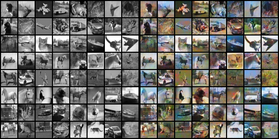
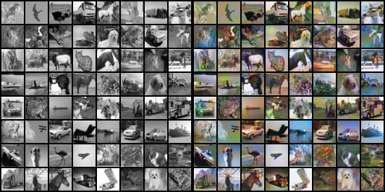
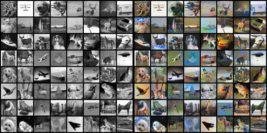
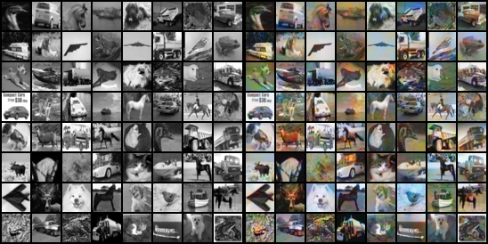

Pytorch Implementation of Glow and conditonal Glow and PixelCNN. Based on the paper:

  > [Density estimation using Real NVP](https://arxiv.org/abs/1807.03039)\
  > Diederik P. Kingma, Prafulla Dhariwal\
  >  arXiv:1807.03039

  > [Conditional Image Generation with PixelCNN Decoders](https://arxiv.org/abs/1606.05328)\
  > Aaron van den Oord, Nal Kalchbrenner, Oriol Vinyals, Lasse Espeholt, Alex Graves, Koray Kavukcuoglu\
  > arXiv:1606.05328

The results for conditional Glow samples can be found in the `gen_imgs` folder.

## MNIST
### Epoch 1

### Epoch 10

### Epoch 20

### Epoch 50

## Usage
The entire code is self contained in the Jupyter notebook,just run the cells sequentially. It is made this way for ease of training on Google Colab.